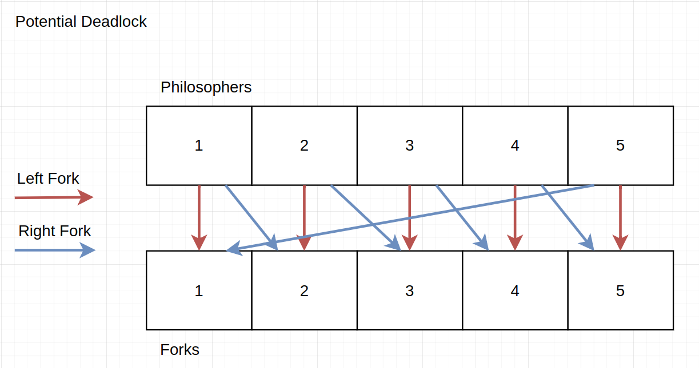
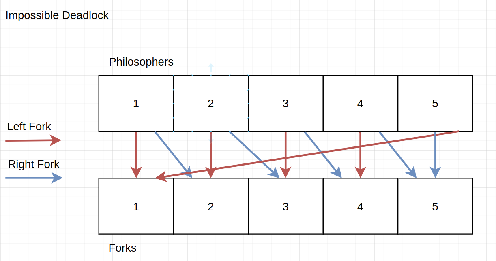

<h3 align="center">42 São Paulo - Philosophers</h3>

<div align="center">


</div>

<div align="center">

[](https://github.com/librity/ft_philosophers/actions/workflows/build.yml)
[](https://github.com/librity/ft_philosophers/actions/workflows/norminette_v3.yml)

<!-- [](https://github.com/librity/ft_philosophers/actions/workflows/socrates.yml) -->

<!-- [](https://github.com/librity/ft_philosophers/actions/workflows/tests.yml) -->

</div>

<p align="center"> An age-old threaded problem in pure C.
  <br>
</p>

---

## 📜 Table of Contents

- [🧐 About](#about)
- [✅ Checklist](#checklist)
- [🏁 Getting Started](#getting_started)
- [📝 Notes](#notes)
- [🛸 42 São Paulo](#ft_sp)
- [📚 Resources](#resources)

## 🧐 About <a name = "about"></a>

A C implementation of the classic
[Dining Philosophers Problem](https://wikiless.org/wiki/Dining_philosophers_problem?lang=en)
by [Edsger Dijkstra](https://wikiless.org/wiki/Edsger_W._Dijkstra?lang=en),
with threads, mutexes, forks and semaphores.

## ✅ Checklist <a name = "checklist"></a>

- [x] Makefile should explicitly name all source files (`make dump_sources`).
- [x] Make must compile without relinking
  - [x] `make all` shouldn't recompile/rearchive any objects or sources.
  - [x] Add `.keep` to object dirs
- [x] Compiles with workspace's `cc` (`clang` version `12.0.1`)
  - [x] Switch Makefile's `clang-12` to `CC` before submitting.
- [x] Test in workspaces
- [x] Written in C.
- [x] Follows `norminette 3.3.51`
- [x] Should not quit unexpectedly (segmentation fault, bus error, double free, etc.)
- [x] All allocated heap memory properly freed, no memory leaks.
  - [x] Use gcc `-fsanitize=leak` flag.
  - [x] Check memory leaks with `valgrind`.
- [x] Compiles with `-Wall -Wextra -Werror`
- [x] No global variables.
- [x] Receive 4-5 arguments.
  - [x] `number_of_philosophers`: number of philosophers and forks.
  - [x] `time_to_die` (ms)
    - [x] Philosophers should die if they didn't eat since the BEGINNING of their last meal/beggining of the simulation.
  - [x] `time_to_eat` (ms)
  - [x] `time_to_sleep` (ms)
  - [x] `number_of_times_each_philosopher_must_eat` (OPTIONAL)
- [x] Index philosophers from 1 to `number_of_philosophers`.
- [x] Program log:
  - [x] `timestamp_in_ms X has taken a fork`
  - [x] `timestamp_in_ms X is eating`
  - [x] `timestamp_in_ms X is sleeping`
  - [x] `timestamp_in_ms X is thinking`
  - [x] `timestamp_in_ms X died`
- [x] Log messages shouldn't mix up with each other.
- [x] Death message should print before 10 ms.
- [x] Philosophers should avoid dying.
- [x] No data races.

### Mandatory

- [x] Program name `philo`
- [x] Turn in `Makefile`, `*.h`, `*.c` , `.gitignore` in directory `philo/`
- [x] Makefile rules: `$(NAME)` `all` `clean` `fclean` `re`
- [x] Allowed functions:
  - [x] `memset` `printf` `malloc` `free` `write` `usleep`
  - [x] `gettimeofday` `pthread_create` `pthread_detach`
  - [x] `pthread_join` `pthread_mutex_init` `pthread_mutex_destroy`
  - [x] `pthread_mutex_lock` `pthread_mutex_unlock`
  - [x] `libft` FORBIDDEN
- [x] Philosophers alternatively `eat`, `sleep` or `think` (in that order)
- [x] Should calculate if philosopher will die and die.
- [x] There are as many forks as philosophers
- [x] Philosophers need to grab `left_fork` and `right_fork` before they can eat.
- [x] Create a thread for each philosopher.
  - [x] Deal with lone philosopher separately.
- [x] Create a mutex for each fork.
- [x] Program ends when any one philosopher dies from starvation
- [x] Program ends when each philosopher ate `number_of_times_each_philosopher_must_eat`
- [x] Guardian Thread:
  - [x] Checks whether any philosopher died/should be dead.
  - [x] Check if everyone ate their last meal.
  - [x] Polling + Mutex
- [x] Pass all testers
  - [x] <https://github.com/GOAT095/philosophers-tester>
  - [x] <https://github.com/nesvoboda/socrates>
  - [x] <https://github.com/wwwwelton/philosophers/blob/master/test.sh>
  - [x] <https://pastebin.pl/view/85d80008>

### Bonus

- [x] Program name `philo_bonus`
- [x] Turn in `Makefile`, `*.h`, `*.c` , `.gitignore` in directory `philo_bonus/`
- [x] Makefile rules: `$(NAME)` `all` `clean` `fclean` `re`
- [x] Allowed functions:
  - [x] `memset` `printf` `malloc` `free` `write` `fork` `kill` `exit`
  - [x] `pthread_create` `pthread_detach` `pthread_join` `usleep` `gettimeofday`
  - [x] `waitpid` `sem_open` `sem_close` `sem_post` `sem_wait` `sem_unlink`
  - [x] `libft` FORBIDDEN
- [x] Create a process for each philosopher.
- [x] Create a semaphore the forks.

## 🏁 Getting Started <a name = "getting_started"></a>

### 📦 Dependencies

You will need `git`, `make` and `clang-12`:

```bash
$ sudo apt-get install git make clang-12
```

### 🖥️ Installing

Clone the repo and build with `make`:

```bash
$ git clone --recurse-submodules https://github.com/librity/ft_philosophers.git
$ cd ft_philosophers/philo
$ make
```

This should create a `philo` executable in the root folder:

```bash
./philo
```

## 📝 Notes <a name = "notes"></a>

### Helgrind error: `lock order "0x4AAB040 before 0x4AAB068" violated`




## 🛸 42 São Paulo <a name = "ft_sp"></a>

Part of the larger [42 Network](https://www.42.fr/42-network/),
[42 São Paulo](https://www.42sp.org.br/) is a software engineering school
that offers a healthy alternative to traditional education:

- It doesn't have any teachers and classes.
- Students learn by cooperating
  and correcting each other's work (peer-to-peer learning).
- Its focus is as much on social skills as it is on technical skills.
- It's completely free to anyone that passes its selection process -
  [**The Piscine**](https://42.fr/en/admissions/42-piscine/)

It's an amazing school, and I'm grateful for the opportunity.

## 📚 Resources <a name = "resources"></a>

### `memset()`

- <https://man7.org/linux/man-pages/man3/memset.3.html>

### `printf()`

- <https://man7.org/linux/man-pages/man3/printf.3.html>

### `malloc()`

- <https://man7.org/linux/man-pages/man3/malloc.3.html>

### `free()`

- <https://man7.org/linux/man-pages/man1/free.1.html>

### `write()`

- <https://linux.die.net/man/2/write>

### `usleep()`

- <https://man7.org/linux/man-pages/man3/usleep.3.html>

### `gettimeofday()`

- <https://man7.org/linux/man-pages/man2/gettimeofday.2.html>
- <https://stackoverflow.com/questions/60932647/gettimeofday-why-use-both-seconds-and-microseconds>
- <https://www.wake-up-neo.net/pt/c/como-obter-o-tempo-atual-em-milissegundos-partir-de-c-no-linux/970965963/>
- <https://man7.org/linux/man-pages/man2/gettimeofday.2.html>

### `pthread_create()`

- <https://man7.org/linux/man-pages/man3/pthread_create.3.html>

### `pthread_detach()`

- <https://man7.org/linux/man-pages/man3/pthread_detach.3.html>

### `pthread_join()`

- <https://man7.org/linux/man-pages/man3/pthread_join.3.html>

### `pthread_mutex_init()`

- <https://man7.org/linux/man-pages/man3/pthread_mutex_init.3p.html>

### `pthread_mutex_destroy()`

- <https://man7.org/linux/man-pages/man3/pthread_mutex_destroy.3p.html>

### `pthread_mutex_lock()`

- <https://www.ibm.com/docs/en/zos/2.2.0?topic=functions-pthread-mutex-lock-wait-lock-mutex-object>
- <https://www.man7.org/linux/man-pages/man3/pthread_mutex_lock.3p.html>

### `pthread_mutex_unlock()`

- <https://man7.org/linux/man-pages/man3/pthread_mutex_lock.3p.html>

### `sem_open()`

- <https://man7.org/linux/man-pages/man3/sem_open.3.html>

### `sem_close()`

- <https://man7.org/linux/man-pages/man3/sem_close.3.html>

### `sem_post()`

- <https://man7.org/linux/man-pages/man3/sem_post.3.html>

### `sem_wait()`

- <https://man7.org/linux/man-pages/man3/sem_wait.3.html>

### `sem_unlink()`

- <https://man7.org/linux/man-pages/man3/sem_unlink.3.html>

### `pthread.h`

- <https://www.man7.org/linux/man-pages/man0/pthread.h.0p.html>
- <https://randu.org/tutorials/threads/>
- <http://files.kipr.org/gcer/2009/proceedings/Myers_ApplicationPthreads.pdf>

### Data Races

- <https://en.cppreference.com/w/c/language/atomic>
- <https://www.delftstack.com/pt/howto/c/atomic-in-c/>

### Atomic Types

- <https://blog.regehr.org/archives/490>
- <https://docs.oracle.com/cd/E19205-01/820-0619/geojs/index.html#:~:text=A%20data%20race%20occurs%20when,their%20accesses%20to%20that%20memory>

### `semaphore.h`

- <https://man7.org/linux/man-pages/man7/sem_overview.7.html>
- <https://wikiless.org/wiki/Inter-process_communication?lang=en>
- <https://www.geeksforgeeks.org/use-posix-semaphores-c/>

### Tutorials

- <https://blog.pantuza.com/artigos/o-jantar-dos-filosofos-problema-de-sincronizacao-em-sistemas-operacionais>
- <https://www.notion.so/Philosophers-2b872948598e4f0cba91c66d8b5ba821>
- <https://rodsmade.notion.site/Acelera-Philosophers-a82a52edabe24ea4a382393fae6c4531>

### Boards

- <https://excalidraw.com/>
- <https://miro.com/app/board/o9J_l0AjIkc=/>
- <https://miro.com/app/board/uXjVOUjzO5Q=/>

### C Quirks

- <https://www.tantalon.com/pete/cppopt/appendix.htm#AppendixB_RelativeCosts>

### Valgrind

- <https://valgrind.org/docs/manual/drd-manual.html>
- <https://valgrind.org/docs/manual/hg-manual.html>
- <http://bl0rg.krunch.be/memleak-pthreads.html>

### Helgrind `Lock Order Violated` Error

- <https://discord.com/channels/706206701598277681/805218621977919498/1021192139272622192>
- <https://stackoverflow.com/questions/62001623/why-does-helgrind-show-lock-order-violated-error-message>

### `nice`

- <https://linux.die.net/man/1/nice>

### Visualizers

- <https://nafuka11.github.io/philosophers-visualizer/>

### Testers

- <https://github.com/GOAT095/philosophers-tester/blob/master/delay_o_meter.py>
- <https://github.com/nesvoboda/socrates>
- <https://github.com/nesvoboda/socrates/blob/master/delay_o_meter.py>
- <https://github.com/wwwwelton/philosophers/blob/master/test.sh>
- <https://pastebin.pl/view/85d80008>

### Videos

- <https://invidious.weblibre.org/playlist?list=PLfqABt5AS4FmuQf70psXrsMLEDQXNkLq2&dark_mode=true>
- <https://invidious.weblibre.org/watch?v=-TFqOIqP-_k&ab_channel=JamieKing&dark_mode=true>
- <https://invidious.weblibre.org/watch?v=2Jmj8F-vpfc&t=109s&dark_mode=true>
- <https://invidious.weblibre.org/watch?v=9axu8CUvOKY&list=PL9IEJIKnBJjFZxuqyJ9JqVYmuFZHr7CFM&index=3&dark_mode=true>
- <https://invidious.weblibre.org/watch?v=DoYXn3nd0Ws&dark_mode=true>
- <https://invidious.weblibre.org/watch?v=GNw3RXr-VJk&dark_mode=true>
- <https://invidious.weblibre.org/watch?v=NbwbQQB7xNQ&dark_mode=true>
- <https://invidious.weblibre.org/watch?v=cx1ULv4wYxM&dark_mode=true>
- <https://invidious.weblibre.org/watch?v=d9s_d28yJq0&dark_mode=true>
- <https://invidious.weblibre.org/watch?v=sDLQWivf1-I&dark_mode=true>
- <https://invidious.weblibre.org/watch?v=trdXKhWAGdg&dark_mode=true>
- <https://yewtu.be/watch?v=ukM_zzrIeXs>

### Python Multithreading

- <https://tenthousandmeters.com/blog/python-behind-the-scenes-13-the-gil-and-its-effects-on-python-multithreading/>
